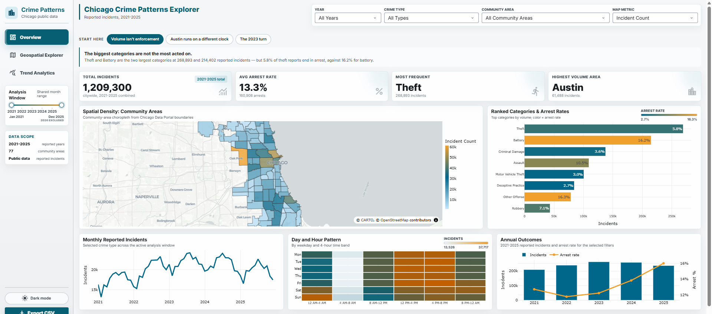
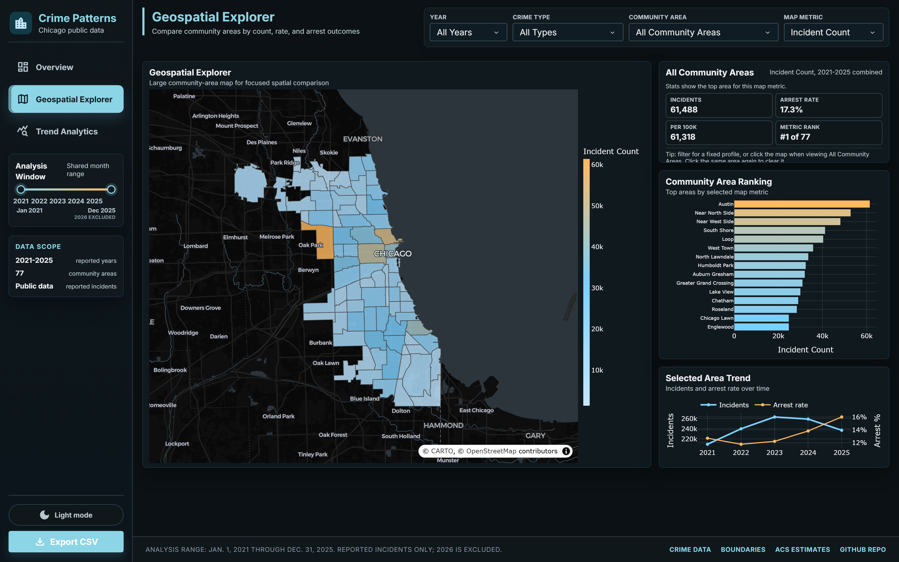
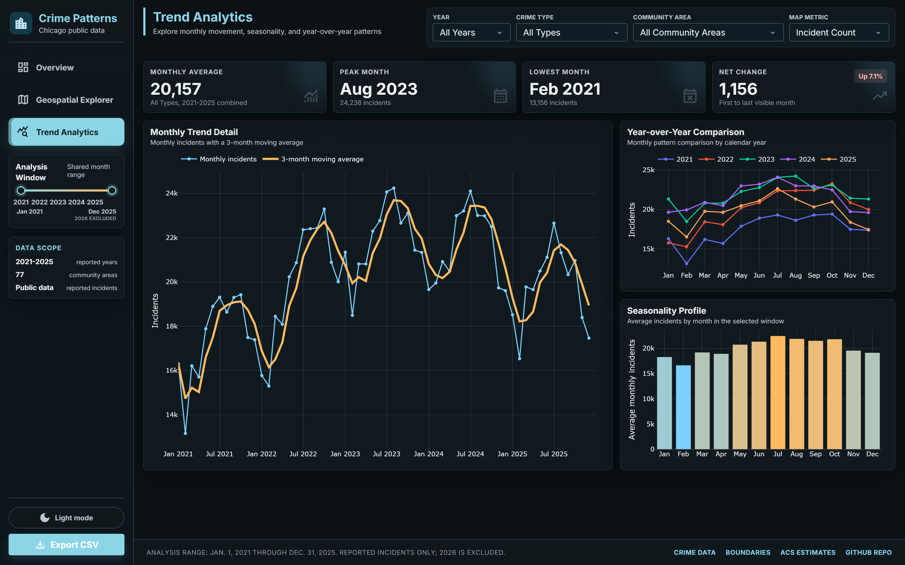

# Chicago Crime Patterns Explorer

An interactive Dash dashboard for exploring 1.2 million reported Chicago crime incidents from 2021 through 2025 — across time, category, and all 77 community areas.



## What the Data Shows

A few findings the dashboard surfaces, and why they motivated the design:

- **Reported incidents rose from 2021 to 2023, then declined through 2025** — while the arrest rate moved the other way, climbing steadily from 12.7% to 16.0%. The 8.5% drop from 2024 to 2025 is a complete-year comparison, not an artifact of partial data. Volume and outcomes are separate stories, so the annual chart plots both on shared axes rather than counts alone.
- **Austin has the highest reported volume of any community area** (61,488 incidents), ahead of Near North Side (52,817).
- **Citywide activity peaks Friday 4-8 PM — but Austin peaks Sunday 12-4 AM.** A single citywide pattern hides that kind of variation entirely, which is the core argument for making every view filterable to one area.
- **High-volume categories are not high-arrest categories.** Theft leads on count with a 5.8% arrest rate, while Battery sits at 16.2%. The ranked bar chart encodes count as length and arrest rate as color so both read at once.

All figures are reported incidents from Chicago public data, not a measure of all crime. See [Methodology and Limitations](#methodology-and-limitations).

## Features

- **Citywide KPIs** — total incidents, arrest rate, most frequent category, and highest-volume community area, all responding to the active filters.
- **Community-area choropleth** with three selectable metrics: incident count, arrest rate, and incidents per 100k residents.
- **Ranked categories** encoding volume and arrest rate simultaneously.
- **Monthly trend, annual outcomes, and a weekday/hour heatmap** for temporal patterns.
- **Dedicated Geospatial and Trend Analytics pages** for deeper per-area and seasonal comparison.
- **Shared filters** across all views, an analysis-window slider, light/dark mode, and CSV export of the current selection.

### Geospatial Explorer



Click any area on the map to pin its profile, ranking, and trend. Clicking the same area again clears the selection, and the Community Area filter overrides map clicks when set.

### Trend Analytics



Monthly detail with a 3-month moving average, year-over-year comparison by calendar month, and a seasonality profile for the selected window.

## Design Decisions Worth Noting

**Empty states are explicit, not implied.** Roughly 13% of crime-type and community-area combinations have no reported incidents at all. In those cases the day/hour heatmap renders an empty grid labeled "No reported incidents for these filters" rather than falling back to another data scope. A dashboard that quietly substitutes citywide numbers for an area with no data invites exactly the misreading this project is trying to avoid.

**Volume and outcome are never collapsed into one number.** Arrest rate appears alongside counts in the KPIs, the ranked categories, the annual chart, and the map metrics, because a high-count category and a high-arrest category are different claims.

**Per-capita is offered but qualified.** Incidents per 100k uses ACS community-area estimates, which makes it a contextual estimate rather than a precise risk measure.

## Quick Start

```bash
pip install -r requirements.txt
cd dashboard
python app.py
```

Open `http://127.0.0.1:8050/`. The app runs locally; it is not deployed to a public server.

To re-fetch and rebuild every data file from the Chicago Data Portal:

```bash
python src/fetch_prepare_data.py
```

## Tech Stack

Python · Dash · Plotly · pandas · HTML/CSS · Chicago Data Portal public datasets

## Project Structure

```text
dashboard/         Dash app, callbacks, and UI assets
data/raw/          Source extracts used by the preparation pipeline
data/shared/       Dashboard-ready lookup, boundary, and count files
data/processed/    Processed summaries used by charts and KPIs
docs/              Methodology notes and screenshots
src/               Data preparation script
```

## Data Sources

- [Crimes - 2001 to Present](https://data.cityofchicago.org/d/ijzp-q8t2) — Chicago Data Portal
- [Community Area Boundaries](https://data.cityofchicago.org/d/igwz-8jzy) — Chicago Data Portal
- [ACS community-area estimates](https://data.cityofchicago.org/d/t68z-cikk) — Chicago Data Portal

## Methodology and Limitations

This dashboard uses reported public-data incidents, which is not a complete measure of crime. Counts reflect reporting behavior, enforcement patterns, data-entry practices, and policy changes as much as they reflect underlying activity.

- Unreported incidents are not captured anywhere in this data.
- The 2021-2025 window is closed and complete. Every month through December 2025 is present, so the 2025 decline reflects reported activity rather than a partial year. 2026 is excluded to keep the window fixed.
- Per-capita rates use ACS estimates rather than a census count, so they are approximations.
- Community-area comparisons can mislead without context. High-traffic commercial areas can show elevated counts that reflect foot traffic rather than residential risk.
- The analysis window is fixed to 2021-2025 so that the overview, geospatial, and trend views stay consistent with one another.

## License

MIT — see [LICENSE](LICENSE).
